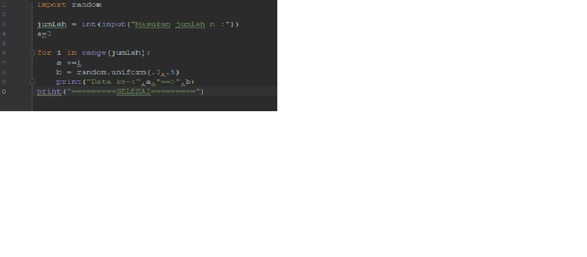
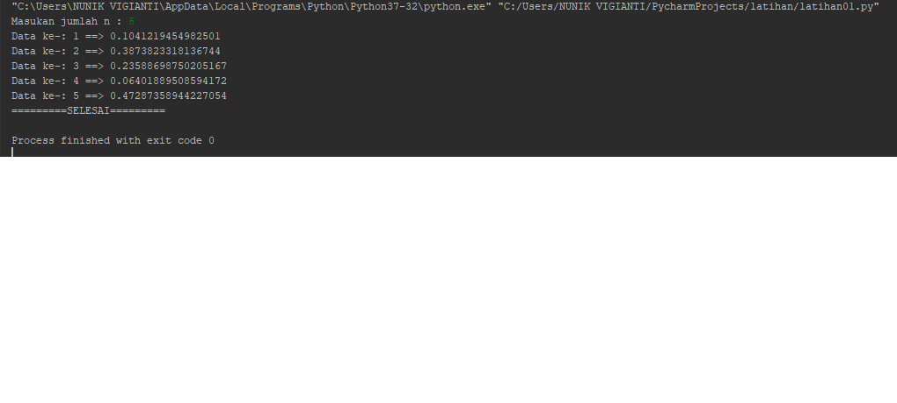
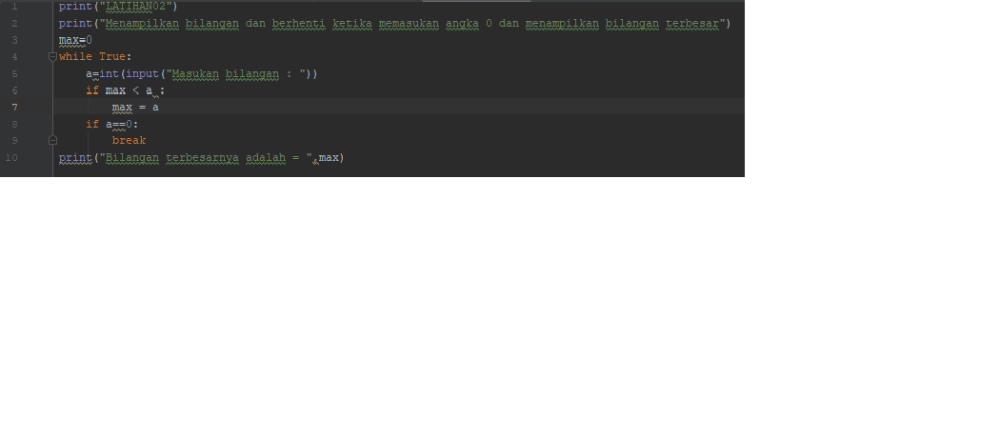
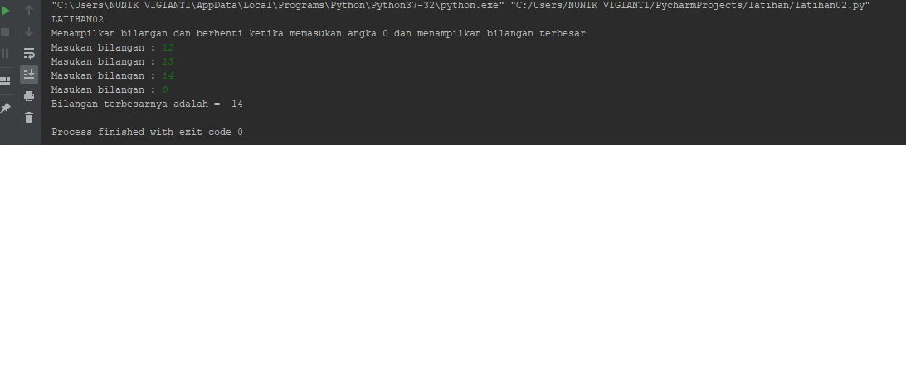
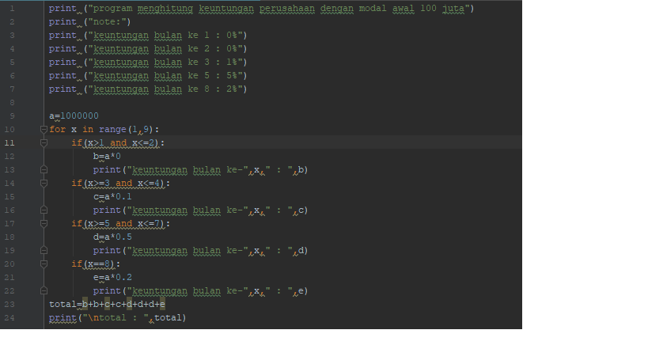
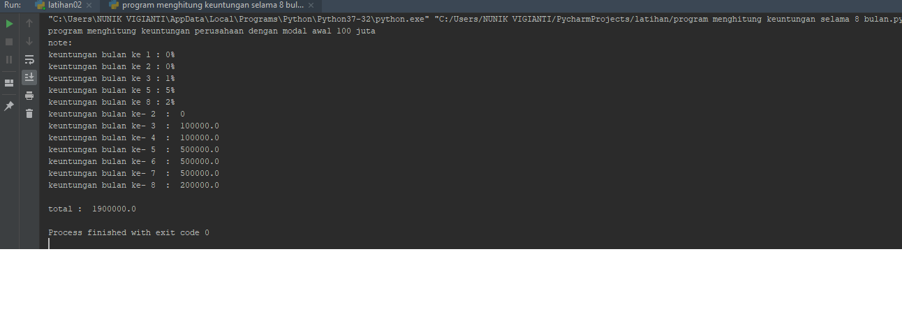

# labpy03
latihan 1 :
Algoritma latihan1 :
Menampilkan n bilangan acak yang lebih kecil dari 0,5, nilai n diisi pada saat runtime.
1.Memasukan/ import fungsi RANDOM terlebih dahulu
2.masukkan jumlah n :
3.Memasukan deskripsi kombinasi for untuk menyelesaikannya.
4.Memasukan nilai jumlah (n) : 5
5.Mencetak data ke 1 sampai 5 dengan hasil nilai kurang dari 0,5.
6.Selesai
syntax latihan 1 sebagai berikut:
#  <h2>
hasil output latihan 01
#  <h2>
Soal latihan 2 :
Algoritma latihan 2:
Membuat program untuk menampilkan bilangan terbesar dari n buah data yang diinputkan.Masukkan angka 0 untuk berhenti
1.Mulai
2.Mencetak "latihan 2"
3.Mencetak "Menampilkan bilangan dan berhenti ketika memasukan angka 0 dan menampilkan bilangan terbesar"
4.integer max = 0
5.Menggunakan fungsi perulangan while true, hingga menampilkan perulangan sampai batas tertentu.
6.Memasukan bilangan integer pada "a"
7.Menggunakan fungsi if jika max kurang dari nilai a, maka max sama dengan a
8.Mengunakan fungsi if jika nilai a adalah 0 maka fungsi break artinya perulangan berhenti jika menulis nilai 0.
9.Mencetak nilai paling terbesarv setelah break, sehingga menampilkan nilai terbesar diantara bilangan tersebut dalam perulangan.
10.selesai
syntax latihan02 sebagai berikut :
#  <h2>
hasil output latihan02
#  <h2>
Soal program 1 :
Seorang pengusaha menginvestasikan uangnya untuk memulai usahanya dengan modal awal 100 juta,
Pada bulan pertama dan kedua belum mendapatkan laba.
Pada bulan ketiga baru mulia mendapatkan laba sebesar 1%
Pada bulan ke lima pendapatan meningkat 5%
Pada bulan ke delapan mengalami penurunan keuntungan sebesar 2%, sehingga laba menjadi 3%.
Hitung total keuntungan selama 8 bulan berjalan usahanya.
ALGORITMA menghitung keuntungan selama 8 bulan berjalannya usaha.
1.Mencetak "Program menghitung keuntungan perusahaan dengan modal awal 100 juta"
2.Membuat Note
3.Mencetak Bulan ke 1 = 0%
4.mencetak bulan ke 2 = 0%
5.Mencetak bulan ke 3 = 1%
6.Mencetak bulan ke 5 = 5%
7.Mencetak bulan ke 8 = 2%
8.integer a = 100.000.000( modal awal)
9.Menggunakan fungsi looping for pada nilai x 1-9 untuk menampilkan bulan 1 sampai bulan 8.
10.Menggunakan fungsi if, untuk menghitung laba bulan 1 sampai 8
11.bulan pertama dan kedua laba adalah 0
12.bulan ke 3 dan ke 4 mendapat laba 1% sehingga modal di kali 1% = keuntungan
13.bulan ke 5 mendapatkan laba 5%, sehingga modal dikali 5% = keuntungan
14.Bulan ke 8 mmendapatkan laba 2% sehingga keuntungan menurun dari bulan sebelumnya, modal dikali 2% = keuntungan.
15.Menghitung jumlah total laba dengan menjumlah keuntungan dari bulan ke 1 sampai bulan 8, hasilnya adalah total keuntungan yang didapat.
16.Selesai
syntax program sebagai berikut
#  <h2>
hasil output program
#  <h2>

 

